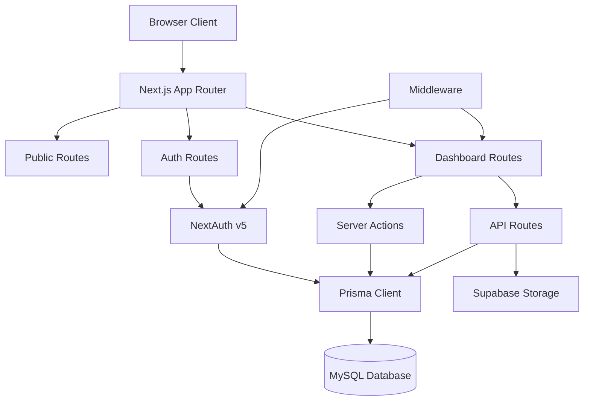
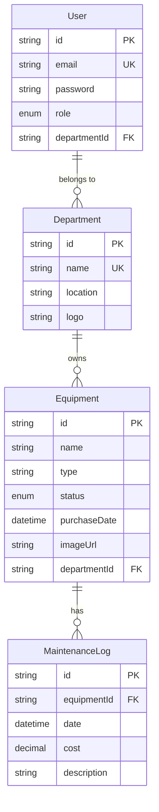

# Design Document

## Overview

RAF-SP is a Next.js 14 application using the App Router architecture with TypeScript. The system follows a three-tier architecture: presentation layer (React components with Tailwind CSS), business logic layer (Server Actions and API routes), and data layer (MySQL via Prisma ORM). Authentication is handled by NextAuth v5 with role-based middleware protection. The application uses Supabase Storage for file management and implements real-time data fetching with TanStack Query.

## Architecture

### High-Level Architecture



### Application Structure

The application follows Next.js 14 App Router conventions with route groups:

- `(public)/` - Unauthenticated landing pages
- `(auth)/` - Login and signup pages
- `dashboard/` - Protected dashboard routes with nested layouts
- `api/` - API routes for file uploads and external integrations

### Technology Stack Rationale

- **Next.js 14 App Router**: Server Components for improved performance, built-in routing, and SEO optimization
- **TypeScript**: Type safety across the entire application
- **Prisma ORM**: Type-safe database queries with excellent MySQL support
- **NextAuth v5**: Industry-standard authentication with built-in CSRF protection
- **Tailwind CSS + shadcn/ui**: Rapid UI development with accessible, customizable components
- **TanStack Query**: Intelligent caching and data synchronization
- **Supabase Storage**: Scalable file storage with CDN capabilities

## Components and Interfaces

### Database Schema (Prisma)

```prisma
generator client {
  provider = "prisma-client-js"
}

datasource db {
  provider = "mysql"
  url      = env("DATABASE_URL")
}

model User {
  id           String      @id @default(cuid())
  name         String
  email        String      @unique
  password     String
  role         Role        @default(DEPT_HEAD)
  departmentId String?
  department   Department? @relation(fields: [departmentId], references: [id])
  createdAt    DateTime    @default(now())
  updatedAt    DateTime    @updatedAt

  @@index([departmentId])
  @@index([email])
}

model Department {
  id        String      @id @default(cuid())
  name      String      @unique
  location  String
  logo      String?
  users     User[]
  equipment Equipment[]
  createdAt DateTime    @default(now())
  updatedAt DateTime    @updatedAt

  @@index([name])
}

model Equipment {
  id              String            @id @default(cuid())
  name            String
  type            String
  status          EquipmentStatus   @default(AVAILABLE)
  purchaseDate    DateTime
  imageUrl        String?
  departmentId    String
  department      Department        @relation(fields: [departmentId], references: [id], onDelete: Cascade)
  maintenanceLogs MaintenanceLog[]
  createdAt       DateTime          @default(now())
  updatedAt       DateTime          @updatedAt

  @@index([departmentId])
  @@index([status])
  @@index([type])
}

model MaintenanceLog {
  id          String    @id @default(cuid())
  equipmentId String
  equipment   Equipment @relation(fields: [equipmentId], references: [id], onDelete: Cascade)
  date        DateTime
  cost        Decimal   @db.Decimal(10, 2)
  description String    @db.Text
  createdAt   DateTime  @default(now())

  @@index([equipmentId])
  @@index([date])
}

enum Role {
  ADMIN
  DEPT_HEAD
}

enum EquipmentStatus {
  AVAILABLE
  IN_USE
  NEEDS_REPAIR
  DISCARDED
}
```

### Component Architecture

#### Public Components

**LandingHero Component**

- Displays hero section with #134866 branding
- Implements Framer Motion entrance animations
- Responsive layout with CTA buttons

**AboutSection Component**

- Government-style informational content
- Scroll-triggered animations
- Responsive grid layout

**Footer Component**

- Large footer with multiple columns
- Government links and contact information
- Social media integration

#### Authentication Components

**LoginForm Component**

- React Hook Form with Zod validation
- Email and password fields
- Error handling and loading states
- Integration with NextAuth signIn()

**SignupForm Component**

- Multi-step form for user registration
- Department selection dropdown
- Password strength validation
- Admin approval workflow

#### Dashboard Components

**DashboardLayout Component**

- Sidebar navigation with role-based menu items
- Header with user profile and logout
- Responsive mobile drawer

**StatsOverview Component**

- Grid of stat cards showing key metrics
- Real-time data fetching with TanStack Query
- Loading skeletons

**EquipmentStatusChart Component**

- Recharts Pie Chart
- Color-coded status segments
- Interactive tooltips
- Responsive sizing

**EquipmentTypeChart Component**

- Recharts Bar Chart
- Grouped by equipment type
- Sortable and filterable
- Export functionality

**EquipmentTable Component**

- TanStack Table with sorting and filtering
- Pagination with configurable page sizes
- Inline editing capabilities
- Bulk action support

**EquipmentForm Component**

- React Hook Form with Zod validation
- Image upload with preview
- Date picker for purchase date
- Status dropdown with visual indicators

**MaintenanceLogList Component**

- Chronological display of maintenance records
- Cost summation
- Add new log functionality
- Export to CSV

**BulkImportDialog Component**

- File upload interface (CSV/PDF)
- Drag-and-drop support
- Progress indicator during parsing
- Error reporting with row-level details

### API Interfaces

#### Server Actions

```typescript
// actions/equipment.ts
export async function createEquipment(
  data: EquipmentFormData
): Promise<ActionResult>;
export async function updateEquipment(
  id: string,
  data: EquipmentFormData
): Promise<ActionResult>;
export async function deleteEquipment(id: string): Promise<ActionResult>;
export async function bulkImportEquipment(
  formData: FormData
): Promise<BulkImportResult>;

// actions/maintenance.ts
export async function createMaintenanceLog(
  data: MaintenanceLogData
): Promise<ActionResult>;
export async function getMaintenanceLogs(
  equipmentId: string
): Promise<MaintenanceLog[]>;

// actions/department.ts
export async function createDepartment(
  data: DepartmentFormData
): Promise<ActionResult>;
export async function updateDepartment(
  id: string,
  data: DepartmentFormData
): Promise<ActionResult>;
export async function deleteDepartment(id: string): Promise<ActionResult>;

// actions/stats.ts
export async function getDashboardStats(
  departmentId?: string
): Promise<DashboardStats>;
```

#### API Routes

```typescript
// app/api/upload/route.ts
POST /api/upload
- Accepts multipart/form-data
- Uploads to Supabase Storage
- Returns public URL

// app/api/auth/[...nextauth]/route.ts
- NextAuth v5 route handler
- Credentials provider configuration
- JWT and session callbacks
```

### Type Definitions

```typescript
// types/index.ts

export interface DashboardStats {
  totalEquipment: number;
  availableCount: number;
  inUseCount: number;
  needsRepairCount: number;
  discardedCount: number;
  equipmentByType: { type: string; count: number }[];
  recentEquipment: Equipment[];
  totalMaintenanceCost: number;
}

export interface BulkImportResult {
  success: boolean;
  imported: number;
  failed: number;
  errors: { row: number; message: string }[];
}

export interface ActionResult {
  success: boolean;
  message?: string;
  data?: any;
}

export interface EquipmentFormData {
  name: string;
  type: string;
  status: EquipmentStatus;
  purchaseDate: Date;
  imageUrl?: string;
  departmentId: string;
}

export interface MaintenanceLogData {
  equipmentId: string;
  date: Date;
  cost: number;
  description: string;
}

export interface DepartmentFormData {
  name: string;
  location: string;
  logo?: string;
}
```

## Data Models

### User Model

- Stores authentication credentials with bcrypt hashed passwords
- Links to Department via foreign key
- Role enum determines access level
- Indexed on email for fast authentication lookups

### Department Model

- Represents organizational units
- One-to-many relationship with Users and Equipment
- Stores logo URL for branding
- Cascade delete protection when equipment exists

### Equipment Model

- Core asset tracking entity
- Status enum for lifecycle management
- Foreign key to Department with cascade delete
- Indexed on status and type for efficient filtering
- Stores Supabase image URL

### MaintenanceLog Model

- Historical record of repairs
- Decimal type for precise cost tracking
- Foreign key to Equipment with cascade delete
- Indexed on date for chronological queries

### Relationships



## Error Handling

### Client-Side Error Handling

**Form Validation Errors**

- Zod schema validation on all forms
- Display field-level error messages
- Prevent submission until valid

**Network Errors**

- TanStack Query retry logic (3 attempts)
- Toast notifications for failed requests
- Fallback UI for data fetching errors

**Authentication Errors**

- Redirect to login on 401 responses
- Display user-friendly error messages
- Session expiration handling

### Server-Side Error Handling

**Database Errors**

- Prisma error handling with specific error codes
- Transaction rollback on failures
- Logging to console/monitoring service

**File Upload Errors**

- File size validation (max 5MB)
- File type validation (images only)
- Supabase error handling with retries

**Bulk Import Errors**

- Row-level error tracking
- Partial success handling
- Detailed error reporting to user

### Error Response Format

```typescript
interface ErrorResponse {
  success: false;
  message: string;
  code?: string;
  details?: any;
}
```

### Middleware Error Handling

```typescript
// middleware.ts
export function middleware(request: NextRequest) {
  try {
    // Auth check
    const token = await getToken({ req: request });

    if (!token && request.nextUrl.pathname.startsWith("/dashboard")) {
      return NextResponse.redirect(new URL("/login", request.url));
    }

    // Role check
    if (request.nextUrl.pathname.startsWith("/dashboard/admin")) {
      if (token?.role !== "ADMIN") {
        return NextResponse.redirect(new URL("/dashboard", request.url));
      }
    }

    return NextResponse.next();
  } catch (error) {
    console.error("Middleware error:", error);
    return NextResponse.redirect(new URL("/login", request.url));
  }
}
```

## Testing Strategy

### Unit Testing

**Components**

- Test rendering with different props
- Test user interactions (clicks, form submissions)
- Test conditional rendering based on roles
- Use React Testing Library

**Utilities**

- Test file parsing functions with sample data
- Test validation schemas
- Test data transformation functions
- Use Vitest

**Server Actions**

- Test with mocked Prisma client
- Test authorization logic
- Test error handling paths
- Use Vitest with Prisma mock

### Integration Testing

**Authentication Flow**

- Test login with valid/invalid credentials
- Test session persistence
- Test logout functionality
- Test middleware protection

**CRUD Operations**

- Test equipment creation with file upload
- Test equipment updates
- Test equipment deletion with confirmations
- Test bulk import with sample files

**Dashboard Data Flow**

- Test data fetching with TanStack Query
- Test chart rendering with real data
- Test filtering and sorting
- Test role-based data visibility

### End-to-End Testing

**Critical User Journeys**

- Admin creates department and assigns user
- Department head logs in and adds equipment
- Department head uploads bulk equipment via CSV
- Department head views dashboard analytics
- Department head adds maintenance log

**Tools**

- Playwright for E2E tests
- Test against staging database
- Run in CI/CD pipeline

### Performance Testing

**Metrics to Monitor**

- Page load time (target: < 2s)
- Time to Interactive (target: < 3s)
- Largest Contentful Paint (target: < 2.5s)
- Animation frame rate (target: 60fps)

**Tools**

- Lighthouse CI
- Next.js built-in analytics
- Chrome DevTools Performance tab

### Testing Priorities

1. Authentication and authorization (critical)
2. Equipment CRUD operations (high)
3. Dashboard data accuracy (high)
4. Bulk import functionality (medium)
5. UI animations and responsiveness (medium)
6. Edge cases and error scenarios (low)

## Security Considerations

### Authentication Security

- Passwords hashed with bcrypt (10 rounds)
- JWT tokens with short expiration (1 hour)
- HTTP-only cookies for session storage
- CSRF protection via NextAuth

### Authorization Security

- Middleware enforcement on all protected routes
- Server-side role checks in Server Actions
- Database-level foreign key constraints
- Row-level security for department data

### File Upload Security

- File type validation (whitelist)
- File size limits (5MB max)
- Virus scanning (future enhancement)
- Signed URLs from Supabase with expiration

### Data Security

- SQL injection prevention via Prisma parameterized queries
- XSS prevention via React automatic escaping
- Environment variables for sensitive credentials
- HTTPS enforcement in production

## Performance Optimizations

### Next.js Optimizations

- Server Components for reduced JavaScript bundle
- Image optimization with next/image
- Route prefetching for faster navigation
- Static generation for landing page

### Database Optimizations

- Indexes on frequently queried columns
- Connection pooling via Prisma
- Pagination for large datasets
- Aggregate queries for dashboard stats

### Frontend Optimizations

- Code splitting by route
- Lazy loading for charts and tables
- TanStack Query caching (5-minute stale time)
- Debounced search inputs
- Optimistic updates for better UX

### Asset Optimizations

- Tailwind CSS purging for minimal CSS bundle
- Framer Motion tree-shaking
- SVG icons instead of icon fonts
- WebP image format for uploads
